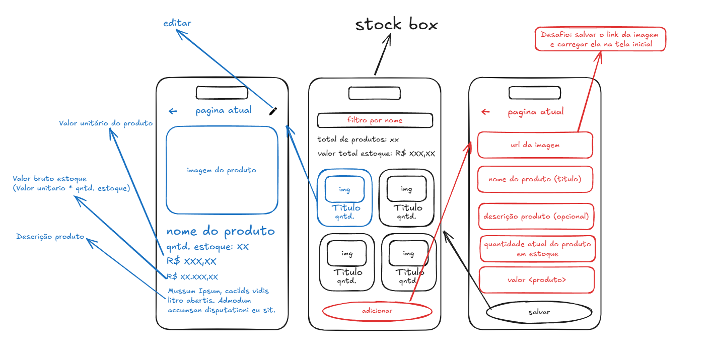

```markdown
# 📦 Stock Box

O **Stock Box** é um aplicativo mobile focado no controle de estoque de produtos, desenvolvido de forma nativa e moderna. Ele permite visualizar o inventário em um formato dinâmico de grade (*grid*), acompanhar indicadores financeiros do valor total armazenado em tempo real, filtrar itens instantaneamente por nome e realizar o gerenciamento completo (cadastro e edição) dos produtos de forma totalmente offline.

---

## ✏️ Do Papel ao Código: O Esboço Idealizado

Todo o fluxo de navegação, arquitetura de dados e interface do aplicativo foi concebido inicialmente através de um protótipo de baixa fidelidade desenhado à mão. Esse planejamento inicial foi fundamental para estruturar o comportamento do app antes de iniciar a programação:



- **Mapeamento de Rotas:** O esboço definiu a navegação cíclica entre três telas principais: Listagem Geral (Home) ➡️ Detalhes do Item ➡️ Formulário de Edição/Cadastro.
- **Lógica Matemática Prévia:** No papel, já havia a definição de que a tela de detalhes deveria calcular e expor o *Valor Bruto do Estoque* multiplicando o valor unitário pela quantidade disponível.
- **Antecipação de Desafios:** O esboço já marcava como um dos principais desafios técnicos a capacidade de receber links/URLs dinâmicos de imagens externas no formulário e renderizá-los perfeitamente nos componentes de imagem da Home e Detalhes.

---

## 🚀 Funcionalidades

- **Tela Inicial (Listagem):**
  - Grid de produtos organizado em duas colunas.
  - Painel de indicadores com totalizador de itens e soma automatizada do valor bruto do estoque ($Quantidade \times Preço$).
  - Filtro de busca por nome em tempo real.
  - Botão flutuante moderno fixado na base para rápida adição.

- **Tela de Detalhes:**
  - Card de exibição para imagens externas ou local (*placeholder*).
  - Informações de estoque separadas por blocos visuais (*cards*).
  - Cálculo e exibição em destaque do valor total específico daquele lote de produtos.

- **Tela de Formulário (Cadastro/Edição):**
  - Campos validados para URL da imagem, nome, descrição, quantidade e preço unitário.
  - Reconhecimento automático do fluxo: a tela muda dinamicamente seu comportamento caso receba um ID para edição ou esteja criando um novo produto.

---

## 🛠️ Tecnologias Utilizadas

- **React Native** & **TypeScript**
- **Expo / Expo Router** (Arquitetura baseada em rotas por arquivos)
- **SQLite (`expo-sqlite`)** (Banco de dados local e persistente)
- **React Native Safe Area Context** (Gestão de layouts e telas responsivas)

---

## ⚠️ Desafios Encontrados & Soluções Implementadas

Durante o ciclo de desenvolvimento do protótipo e evolução do MVP, deparei-me com alguns obstáculos críticos de interface (UI) e experiência do usuário (UX). Abaixo estão detalhadas as dificuldades e como foram superadas:

### 1. Interferência de Elementos Nativos do Sistema (*Notch* e Câmeras)
- **Dificuldade:** Em dispositivos mais novos com telas infinitas, os cabeçalhos de navegação e títulos das páginas (como a tela de cadastro) ficavam cortados ou escondidos exatamente atrás da câmera frontal (*notch*).
- **Solução:** Implementou-se o hook `useSafeAreaInsets` da biblioteca `react-native-safe-area-context`. Com isso, calculamos dinamicamente a folga superior necessária de cada aparelho e aplicamos um `paddingTop` customizado, empurrando o cabeçalho de forma segura para baixo da área da câmera.

### 2. Área de Toque Reduzida (*Touch Target*) nos Botões
- **Dificuldade:** O botão de retorno (`←`) e o de edição nas telas de detalhes eram muito pequenos. Como o toque do dedo humano não é cirúrgico, o usuário precisava clicar várias vezes até conseguir acionar a ação, gerando frustração.
- **Solução:** Refatorou-se a estrutura dos botões envolvendo os elementos de texto em componentes `<TouchableOpacity>` com espaçamentos internos (*paddings*) generosos e fundos acinzentados sutis (`#e5e7eb`). Isso aumentou consideravelmente a área invisível de clique para seguir os padrões de UX Mobile (mínimo de 44x44 pixels).

### 3. Fadiga Visual por Cores Contrastantes e Agressivas
- **Dificuldade:** Os *placeholders* e bordas dos inputs utilizavam a cor vermelha pura, o que passava uma impressão de "erro constante" e gerava cansaço visual rápido durante o preenchimento de formulários.
- **Solução:** Substituiu-se a paleta de cores antiga por uma interface *Clean/Minimalista*. O fundo geral adotou um cinza claro neutro (`#f8f9fa`) e as caixas de texto ganharam fundos brancos puros (`#fff`) com bordas suaves e sombras leves. As cores de ação principal herdaram um tom azul confiável (`#4c7de7`) e os ganhos financeiros mudaram para verde (`#10b981`).

### 4. Itens Escondidos Atrás do Botão Fixo Inferior
- **Dificuldade:** Ao fixar o botão `+ Adicionar Produto` de forma absoluta no rodapé para melhorar a usabilidade, os últimos elements da lista no grid (`FlatList`) passavam por baixo dele e ficavam inacessíveis para clique.
- **Solução:** Aplicou-se a propriedade `contentContainerStyle={{ paddingBottom: 100 }}` diretamente na `FlatList`. Isso cria uma folga transparente interna na rolagem, permitindo que o usuário suba a lista até o fim sem que o botão cubra os dados.

### 5. População Inicial de Dados para Demonstração (*Seed Data*)
- **Dificuldade:** Ao abrir o aplicativo pela primeira vez ou em um novo computador, o banco de dados SQLite iniciava zerado, fazendo com que a tela parecesse vazia e dificultando testes imediatos.
- **Solução:** Atualizou-se a função de inicialização do banco (`setupDatabase`) para realizar um `SELECT COUNT(*)`. Se a tabela estiver vazia, o sistema faz uma inserção em lote automatizada de 5 produtos fictícios com imagens reais da internet já configuradas, servindo como uma versão demonstrativa instantânea.

---

## ⚙️ Como Executar o Projeto

1. Clone o repositório:
```bash
   git clone [https://github.com/seu-usuario/Stock-Box.git](https://github.com/seu-usuario/Stock-Box.git)

```

2. Instale as dependências:

```bash
   npm install

```

3. Inicie o servidor do Expo limpando o cache:

```bash
   npx expo start -c

```

4. Escaneie o QR Code utilizando o aplicativo **Expo Go** no seu dispositivo Android ou iOS.

```

```